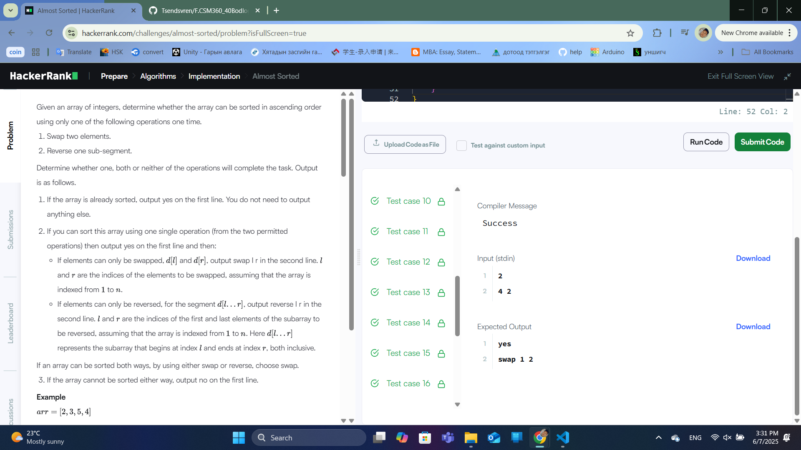

### Бодлого №10

## Almost Sorted

Өгөгдсөн тоон дарааллыг яг нэг алхамаар эрэмбэлэх боломжтой эсэхийг тодорхойл. Хэрэв боломжтой бол:

swap l r: l ба r индексийн тоонуудыг солих

reverse l r: l-ээс r хүртэлх дэд дарааллыг урвуулах

Эсвэл "no" гэж хэвлэ.

Оролт

Эхний мөр: n (дарааллын урт)

Хоёр дахь мөр: n ширхэг бүхэл тоо

Гаралт

Дээрх команд эсвэл "no"

Жишээ

Оролт 1:

5

1 4 3 2 5

Гаралт 1:

yes

reverse 2 4

Оролт 2:

5

1 2 3 4 5

Гаралт 2:

yes

Бодолт

Эрэмбэлэгдсэн дарааллыг ол: Өгөгдсөн дарааллыг эрэмбэлэгдсэнтэй харьцуулах

Ялгаатай байрлалуудыг ол: Эрэмбэлэгдсэн дарааллаас хазайсан индексийг тэмдэглэ

Шалгах:

Хэрэв 2 индексийн тоонуудыг солиход эрэмбэлэгдсэн бол swap

Хэрэв дэд дарааллыг урвуулахад эрэмбэлэгдсэн бол reverse

Бусад тохиолдолд "no"

  

  

  

---

✅ **ТАЙЛАН ДУУСАВ!**
