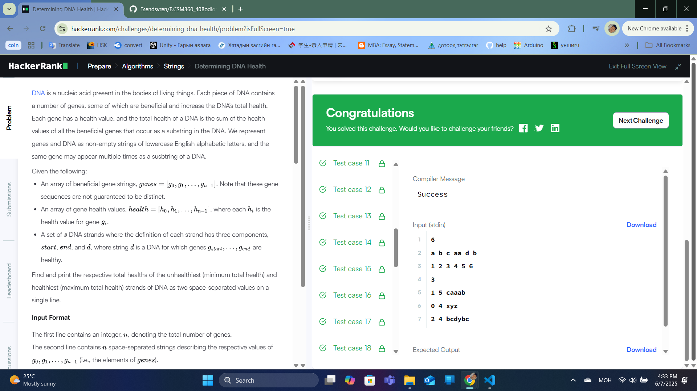
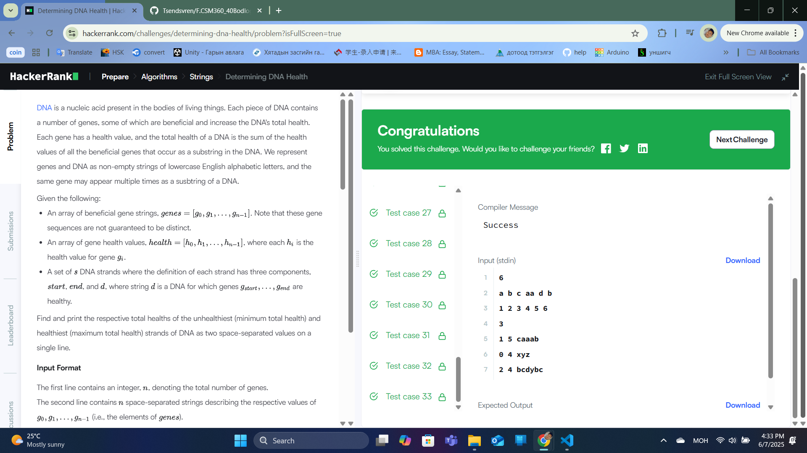

### Бодлого №11

## Determining DNA Health

ДНК-ийн эрүүл мэндийг тооцоолох:

Өгөгдсөн genes ба health массивууд

d хэмжээтэй дарааллын хувьд:

first-ээс last хүртэлх генүүдийг сонгох

d-д генүүдийн тохиолдлыг тоолж, health-ийг нэмэх

Хамгийн бага ба их health-ийг ол

Оролт

n: genes/health массивын урт

genes: ДНК-ийн генүүд

health: Ген бүрийн эрүүл мэндийн оноо

s: Шалгах дарааллын тоо

s мөр: first, last, d (ДНК дараалал)

Гаралт

Хамгийн бага ба их health

Жишээ

Оролт:

6

a b c aa d b

1 2 3 4 5 6

3

1 5 caaab

0 4 xyz

2 4 bcdybc

Гаралт:

0 19

Бодолт

Aho-Corasick алгоритм: Генүүдийн автомат бүтээх

Хэрэглээний health-ийг тооцох:

first-last-ын health-ийг нэмэх

Давталтад автоматыг ашиглах

Min/max health-ийг тодорхойлох

  

  

  

---

✅ **ТАЙЛАН ДУУСАВ!**
