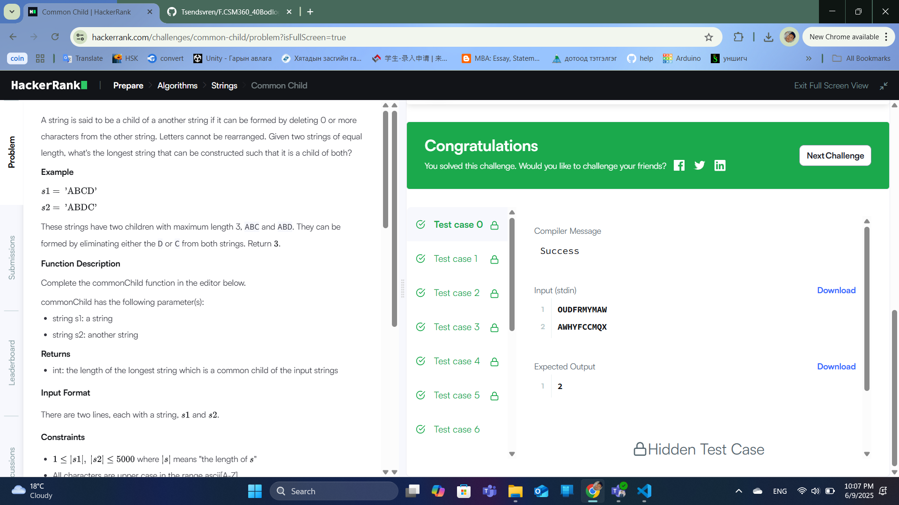
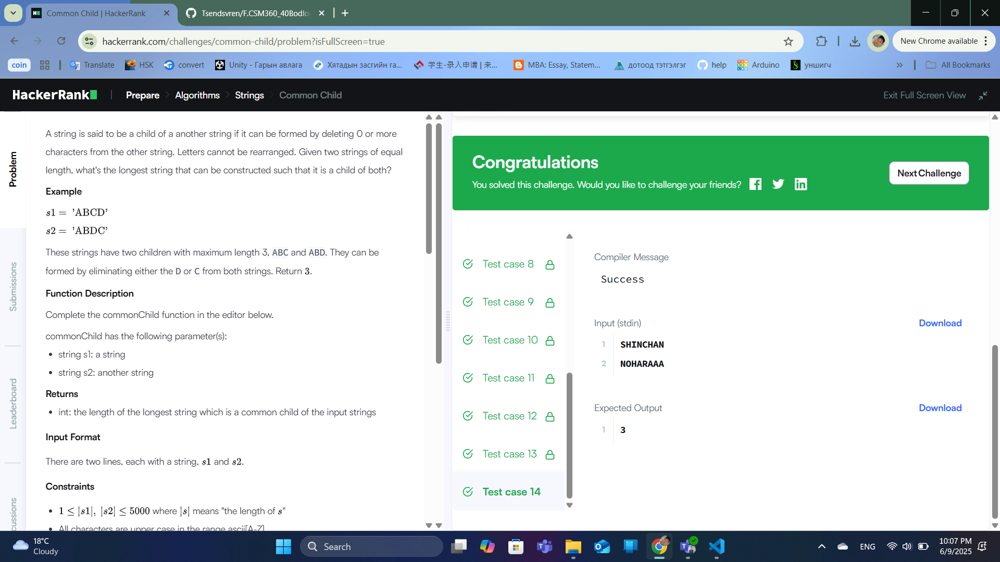

### Бодлого №15

## Common Child /Төрөл: Algorithms, Түвшин: Advanced/

Танд `A` болон `B` гэсэн хоёр мөр өгөгдөнө. Та эдгээр хоёр мөрний хооронд хамгийн урт **нийтлэг хүүхэд мөр** (common child string)-ийн уртыг олох ёстой.

**Common child** гэж дараах нөхцлийг хангах тэмдэгтүүдийн дарааллыг хэлнэ:

- Энэ нь `A` болон `B` хоёрт **дараалал алдалгүй** орсон байх (substring биш, subsequence байх),

- Харин үсгүүдийн байрлал адил биш байж болно,

- Зөвхөн үсгүүдийн дарааллыг хадгалсан байхад хангалттай.

Жишээ

Оролт:

HARRY

SALLY

Гаралт:

2

Тайлбар:

- Нийтлэг хүүхэд мөр нь `"AY"` байна.

Шийдлийн тайлбар

- Энэ бол **Longest Common Subsequence (LCS)** асуудал бөгөөд динамик програмчлалаар шийднэ.

- 2D хүснэгт (таблица) ашиглан A ба B мөрийн бүх хос үсгийг харьцуулж хамгийн урт нийтлэг дарааллыг хадгална.

- Эцэст нь хүснэгтийн сүүлийн утга (таблицын баруун доод буланд) хамгийн урт нийтлэг дарааллын урт болно.

Бодлогын шалгасан нөхцлүүд

- Том жижиг үсэг ялгана.

- Хоосон мөр, эсвэл нийтлэг үсэггүй тохиолдлыг зөв шалгасан.

- Динамик хүснэгт зөв бөглөгдсөн.

  

  

---

✅ **ТАЙЛАН ДУУСАВ!**
