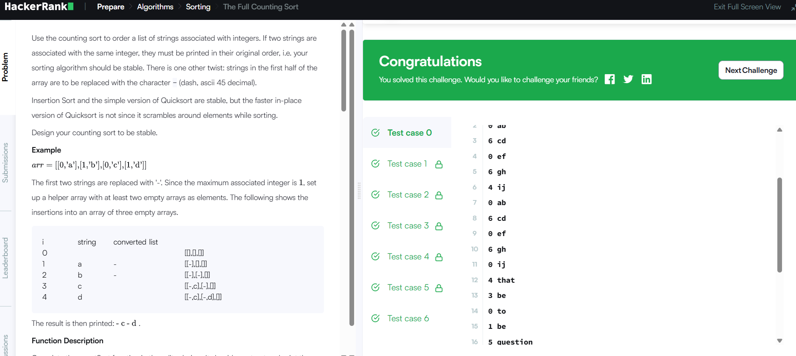

### Бодлого №18

### The Full Counting Sort /Төрөл: Algorithms, Түвшин: Advanced/

Танд `n` ширхэг өгөгдөл өгөгдөнө. Өгөгдөл бүр нь 2 хэсгээс бүрдэнэ:

- `x` — бүтэн тоо (0-с 99 хүртэл)

- `s` — үг (стринг)

Таны зорилго бол өгөгдлийг `x` утгын дагуу эрэмбэлж, эхний `n/2` өгөгдлийн үгийг орлуулахын оронд `-` гэсэн тэмдэгтэй хэвлэх.

Оролт

- `n` — өгөгдлийн тоо

- Дараах мөр бүрд `x s` байна.

Гаралт

- Эрэмбэлэгдсэн дарааллаар бүх үгийг нэг мөрөнд зайгаар тусгаарлан хэвлэх.

- Эхний `n/2` өгөгдлийн үгийг орлуулахад `-` гэсэн тэмдэг ашиглана.

Жишээ

Оролт:

10

0 ab

6 cd

0 ef

6 gh

4 ij

0 ab

6 cd

0 ef

6 gh

0 ij

Гаралт:

cd gh cd gh ij

Шийдлийн тайлбар

1. Өгөгдлийг `x` утгаар нь эрэмбэлнэ.

2. Эхний `n/2` өгөгдлийн үгийг `-` гэж хэвлэнэ.

3. Дараагийнх нь өөрийн үг хэвлэгдэнэ.

4. Эрэмбэлэлт болон хэвлэлтийг үр дүнтэй хийхийн тулд `counting sort` аргыг ашиглана.

Алгоритмын санаа

- `counting sort` ашиглан `x` утгаар бүлэглэнэ.

- Өгөгдлийг хүлээн авахдаа эхний хагасыг `-` гэж хадгалж, дараагийн хэсгийг өөрийн үгтэй хадгална.

- Бүлэглэсэн дарааллаар бүх үгийг хэвлэнэ.

Бодлогын шалгасан нөхцлүүд

- Том хэмжээний өгөгдөл дээр хурдан ажилласан

- Эрэмбэлэлт зөв хийгдсэн

- Хариуг зөв хэвлэсэн

  

---

✅ **ТАЙЛАН ДУУСАВ!**