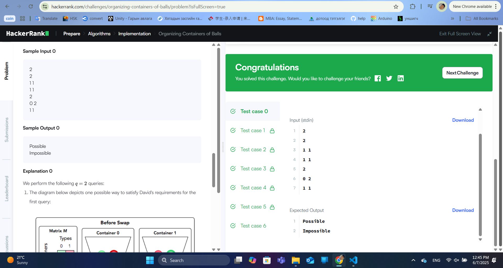

### Бодлого №1

## Organizing Containers Of Balls 

Та нарт n ширхэг сав байгаа бөгөөд сав бүрд тодорхой тооны бөмбөлгүүд байна. Бөмбөлгүүд нь m өөр өнгөтэй байх ба container[i][j] нь i-р саванд байгаа j өнгийн бөмбөлгийн тоог илэрхийлнэ.

Таны даалгавар бол бөмбөлгүүдийг савнуудын хооронд солих замаар сав бүрт зөвхөн нэг өнгийн бөмбөлөг байхаар зохион байгуулах боломжтой эсэхийг тодорхойлох явдал юм. Солих үйлдэл бүрт та нэг саваас нөгөө саванд нэг бөмбөлөг шилжүүлэх бөгөөд ямар ч өнгийг сонгож болно.

Оролт
Эхний мөрөнд q тоо байх ба энэ нь асуултын тоог илэрхийлнэ.

Дараа нь q ширхэг асуулт байх бөгөөд асуулт бүр дараах хэлбэртэй байна:

Эхний мөрөнд савны тоо (n) ба өнгөний тоо (m) байна (ихэнх тохиолдолд n = m).

Дараагийн n мөр бүрт m ширхэг бүхэл тоо байх ба i-р мөр j-р баганад container[i][j]-ийг илэрхийлнэ.

Гаралт
Асуулт бүрийн хувьд боломжтой бол "Possible", боломжгүй бол "Impossible" гэж хэвлэнэ.

Жишээ
Оролт:

text
2
2
1 1
1 1
2
0 2
1 1
Гаралт:

text
Possible
Impossible
Бодолт
Энэ бодлогын гол түлхүүр нь сав бүрт байгаа бөмбөлгүүдийн нийт тоо (capacity) болон өнгө бүрийн нийт бөмбөлгүүдийн тоо (balls) хоёрын олонлогууд ижил байх эсэхийг шалгах явдал юм. Хэрэв эдгээр олонлогууд ижил байвал "Possible", эсрэг тохиолдолд "Impossible" гэж хариулах хэрэгтэй.

Алгоритм
Сав бүрийн нийт бөмбөлгүүдийн тоог (capacity[i]) тооцоолох:

capacity[i] = sum(container[i][j] for all j)

Өнгө бүрийн нийт бөмбөлгүүдийн тоог (balls[j]) тооцоолох:

balls[j] = sum(container[i][j] for all i)

capacity болон balls массивуудыг эрэмбэлэх.

Хэрэв эрэмбэлэгдсэн capacity болон balls массивууд ижил байвал "Possible", үгүй бол "Impossible" гэж хариулах.

Жишээний шинжилгээ
Эхний жишээ:

text
2
1 1
1 1
capacity = [1+1=2, 1+1=2] → [2, 2]

balls = [1+1=2, 1+1=2] → [2, 2]

Эрэмбэлэгдсэн capacity болон balls ижил ([2, 2]), тиймээс "Possible".

Хоёр дахь жишээ:

text
0 2
1 1
capacity = [0+2=2, 1+1=2] → [2, 2]

balls = [0+1=1, 2+1=3] → [1, 3]

Эрэмбэлэгдсэн capacity ([2, 2]) болон balls ([1, 3]) ижил биш, тиймээс "Impossible".

  

---

✅ **ТАЙЛАН ДУУСАВ!**
