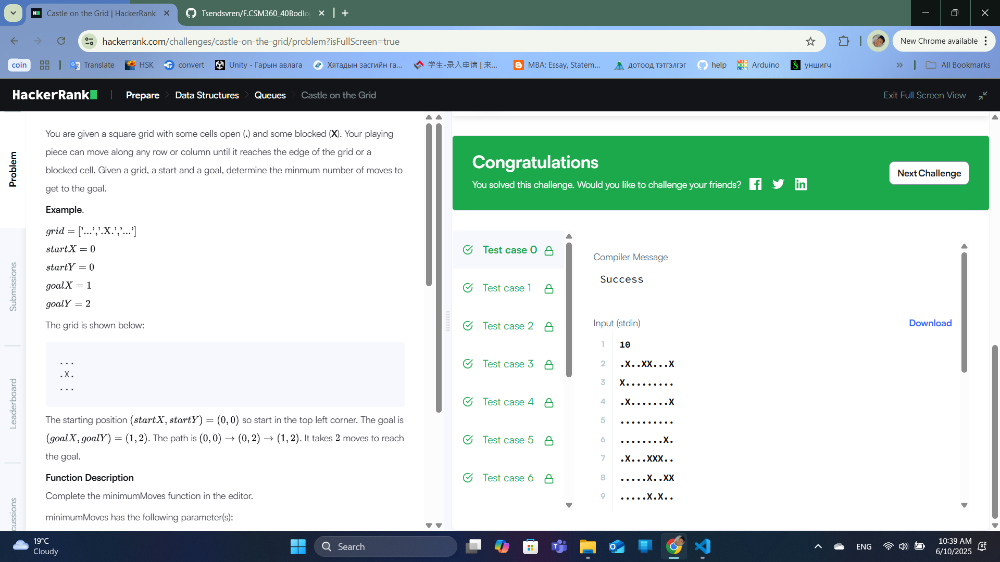
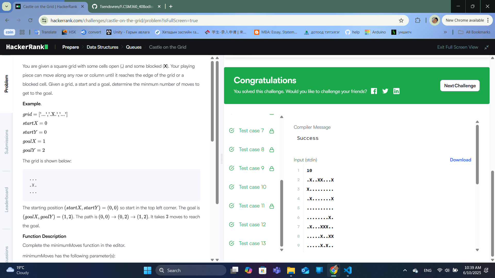

### Бодлого №25

### Castle on the Grid /Төрөл: Data Structures, Түвшин: Medium/

Танд `n x n` хэмжээтэй сүлжээ буюу grid өгөгдөнө.

- Grid-ийн зарим нүд нь саад (X), бусад нь чөлөөтэй (.) байна.

- Та нэг байрлал дээрээс босоо эсвэл хэвтээ чиглэлд сааданд мөргөлгүйгээр явж чадна.

- Эхлэх байрлал болон зорилтот байрлал өгөгдсөн.

- Эдгээрээс хамгийн бага алхам (move) ашиглан хэрхэн зорилгод хүрэхийг олно.

Оролт

- `n` — grid-ийн хэмжээ

- Дараах `n` мөрт grid-ийн төлөв (`.` эсвэл `X`)

- Эхлэх байрлалын x, y координат

- Зорилтот байрлалын x, y координат

Гаралт

- Хамгийн бага алхмын тоо

Жишээ

Оролт:

.X.

.X.

...

0 0

0 2

Гаралт:

3

Шийдлийн тайлбар

- BFS (Breadth-First Search) ашиглан хамгийн бага алхмыг олох.

- Босоо болон хэвтээ чиглэлд саадгүйгээр аль болох хол алхана.

Алгоритмын санаа

- BFS-ээр grid-ийн нүд бүрийг зочилж, хамгийн бага алхамыг хадгална.

- Ойролцоо босоо, хэвтээ чиглэлийн бүх боломжийг судална.

- Саадтай эсвэл аль хэдийн очсон газрыг орхино.

Бодлогын шалгасан нөхцлүүд

- Хурдан ажиллагаатай

- Алхам бүрийн зөв тоолол

- Сааднуудыг зөв тооцсон

  

  

---

✅ **ТАЙЛАН ДУУСАВ!**