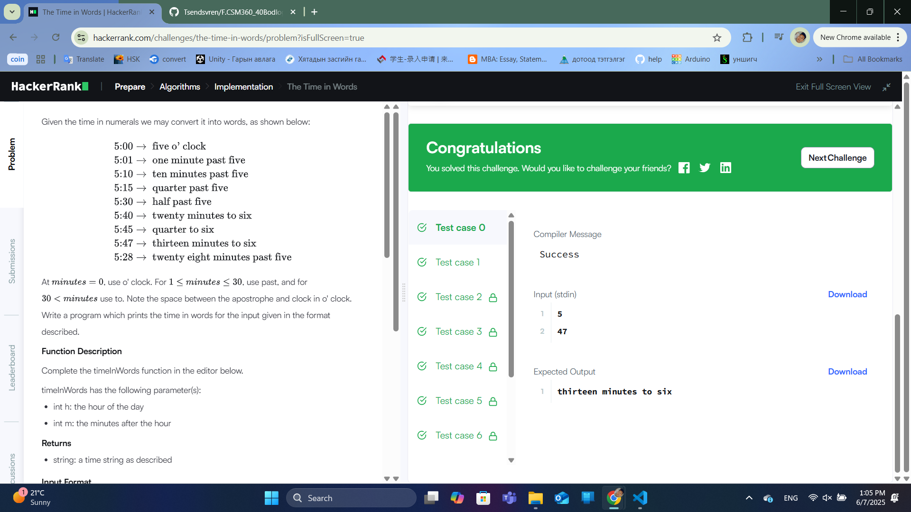
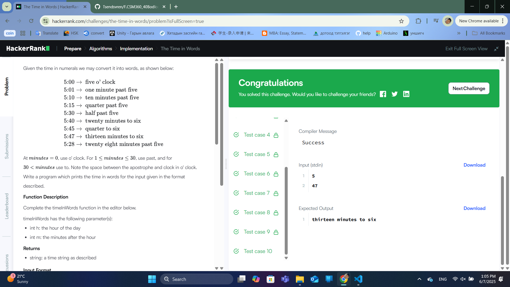

### Бодлого №1

## The Time in Words

Таныг цагийг англи үгээр хэлэх даалгавар өгөв. Оролтонд цаг (h) ба минут (m) өгөгдөх бөгөөд та үүнийг англи хэлний дүрмийн дагуу үгээр хэлбэрт оруулах хэрэгтэй.

Хэрэв минут (m) 0-тэй тэнцүү бол "h o' clock" гэж хэлнэ.

Хэрэв минут (m) 1-ээс 30 хүртэл байвал "past" гэж хэрэглэнэ. Жишээ нь "quarter past h".

Хэрэв минут (m) 30-аас их байвал "to" гэж хэрэглэнэ. Жишээ нь "half to h+1".

15, 30, 45 минутуудыг "quarter", "half" гэх мэтээр тусгайлан хэлнэ.

1 минутыг "one minute", бусад тохиолдолд "x minutes" гэж хэлнэ.

Оролт
Эхний мөр: h (1 ≤ h ≤ 12)

Хоёр дахь мөр: m (0 ≤ m < 60)

Гаралт
Цагийг англи үгээр хэлсэн мөр.

Жишээ
Оролт 1:

5

47

Гаралт 1:

thirteen minutes to six

Оролт 2:

3

00

Гаралт 2:

three o' clock

Оролт 3:

7

15

Гаралт 3:

quarter past seven

Бодолт

Энэ бодлогыг шийдэхийн тулд бид минутыг англи хэлэнд хэрхэн хэлэхийг мэдэх хэрэгтэй. Үүнд:

0-30 минутыг "past" гэж хэрэглэх бөгөөд цаг нь өөрчлөгдөхгүй.

30-аас дээш минутыг "to" гэж хэрэглэх бөгөөд цаг нь h + 1 болно.

Тусгай тохиолдлууд:

0 минут: "h o' clock"

15 минут: "quarter past h"

30 минут: "half past h"

45 минут: "quarter to h+1"

Бусад тохиолдолд минут болон цагийг англи үгээр хөрвүүлэх хэрэгтэй.

Алгоритм

Минутыг шалгах:

Хэрэв m == 0: "h o' clock"

Хэрэв m == 15: "quarter past h"

Хэрэв m == 30: "half past h"

Хэрэв m == 45: "quarter to h+1"

Хэрэв 1 <= m <= 30: "m minutes past h"

Хэрэв 30 < m < 60: "60 - m minutes to h + 1"

Тоонуудыг англи үгээр хөрвүүлэх функц бичих.

  

  

---

✅ **ТАЙЛАН ДУУСАВ!**
