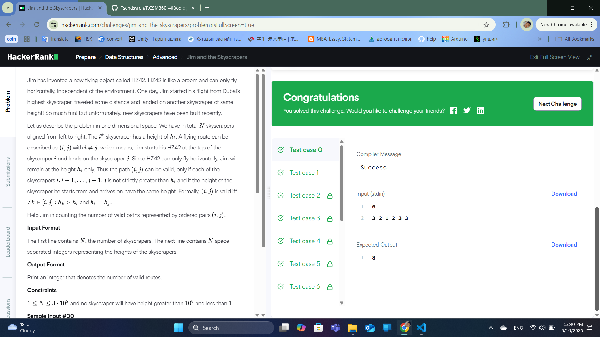
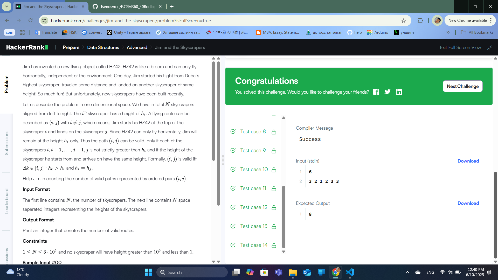

### Бодлого №30

### Jim and the Skyscrapers /Төрөл: Data Structures, Түвшин: Medium/

Танд өндөрүүдийн жагсаалт өгөгдөнө.

- Jim хотын өндөр барилгуудын дунд зогсож байна.

- Тэрээр барилга тус бүрээс өөр барилга харах боломжтой эсэхийг шалгах хэрэгтэй.

- Барилга нэг бүрийн хувьд барилгын баруун талд түүнээс намхан барилгуудыг тоолно.

Оролт

- `n` — барилгын тоо

- Барилгын өндөрүүдийн массив

Гаралт

- Барилга тус бүрээс харж болох барилгуудын тоо

Жишээ

Оролт:

6

3 5 4 4 3 1

Гаралт:

1 3 1 1 1 0

Шийдлийн тайлбар

- Барилга тус бүрээс баруун талд байгаа түүнээс намхан барилгуудыг тоолно.

- Өндөр нь ижил бол тоолохгүй.

Алгоритмын санаа

- Циклээр барилга тус бүрийн дараах барилгуудыг шалгах.

- Өндөр нь бага бол тоолж үргэлжлүүлнэ.

- Өндөр нь өндөртэй таарах эсвэл өндөртэй барилга гарвал тоолол зогсоно.

Бодлогын шалгасан нөхцлүүд

- Зөв тоолол.

- Цаг хугацааны хувьд хэмнэлттэй

- Оролт гаралтын жишээг зөв шийдсэн

  

  

---

✅ **ТАЙЛАН ДУУСАВ!**