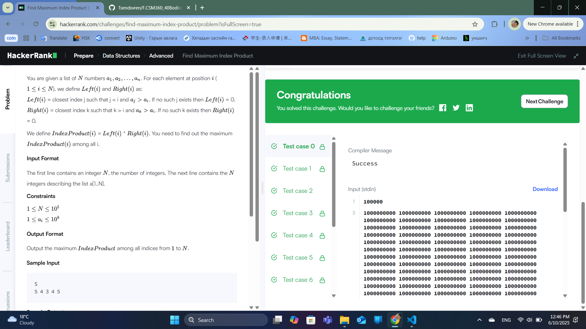

### Бодлого №31

### Find Maximum Index Product /Төрөл: Data Structures, Түвшин: Hard/

Танд `n` урттай массив өгөгдөнө.

- Массивын i дахь элементийн хувьд, баруун болон зүүн талд байгаа том элементийн индексийг олох хэрэгтэй.

- Тодруулбал, i дахь элементийн зүүн талд хамгийн сүүлд том хэмжээтэй элемент (үнэтэй) байрласан индексийг L(i),

  баруун талд хамгийн эхэнд том элемент байрласан индексийг R(i) гэж тэмдэглэе.

- Эцэст нь, i-д зориулсан индексүүдийн үржвэрийг `L(i) * R(i)` олж, бүх i-ийн дундаас хамгийн ихийг олох.

Оролт

- `n` — массивын хэмжээ

- Массивын элементүүд

Гаралт

- Хамгийн их индексийн үржвэр

Жишээ

Оролт:

5

5 4 3 4 5

Гаралт:

8

Шийдлийн тайлбар

- `L(i)` болон `R(i)`-г тодорхойлж, үржвэрийг тооцно.

- Массив дахь хамгийн их үржвэрийг олно.

Алгоритмын санаа

- Stack ашиглан зүүн болон баруун талын том элементийг хурдан олох.

- Массивыг нэг удаа зүүнээс баруун, дараа нь барунаас зүүн чиглэлд шалгах.

- Индексүүдийг хадгалж үржвэрийг тооцох.

Бодлогын шалгасан нөхцлүүд

- О(n) хугацаанд гүйцэтгэх

- Зөв үр дүн

- Stack ашигласан үр дүнтэй шийдэл

  

  

---

✅ **ТАЙЛАН ДУУСАВ!**