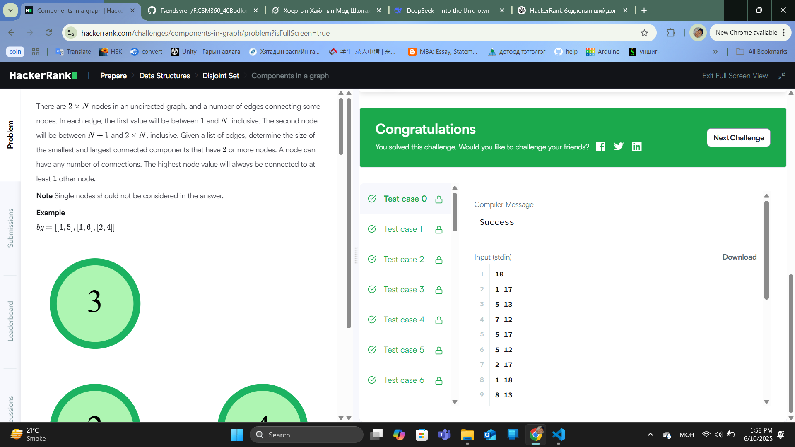

### Бодлого №33

### Components in a graph /Төрөл: Data Structures, Түвшин: Hard/

Танд 2 * n орой бүхий граф (оройнууд нь 1-ээс 2n хүртэлх дугаартай) өгөгдөнө. Эхэндээ бүх орой тус тусдаа байгаа буюу ямар ч холбоос байхгүй. Дараа нь танд n ширхэг зах холбоос (edge) өгөгдөнө. Таны даалгавар бол эдгээр захуудыг нэмэхэд үүссэн холбогдсон компонентүүдийн хамгийн бага болон хамгийн том (2-оос дээш оройтой) хэмжээтэйг тодорхойлох юм.

Оролт:

Эхний мөр: n — холбоосын тоо (жишээлбэл, 4)

Дараагийн n мөр тус бүр: u v — оройн дугаарууд (1 ≤ u, v ≤ 2n) хоорондын зах

Гаралт:

1 мөрөнд 2 бүхэл тоо:

Холбогдсон бүх компонентүүдийн хамгийн бага хэмжээтэй (2-с дээш оройтой)

хамгийн том хэмжээтэй холбогдсон компонентын хэмжээ

🧮 Жишээ:

Оролт:

4

1 2

3 4

1 3

5 6

Графын тайлбар:

1–2, 3–4, дараа нь 1–3 → 1, 2, 3, 4 нь бүгд холбогдсон

5–6 — тусдаа жижиг компонент

Компонентууд:

{1, 2, 3, 4} — 4 оройтой

{5, 6} — 2 оройтой

Гаралт:

2 4

  

  

  

  

---

✅ **ТАЙЛАН ДУУСАВ!**