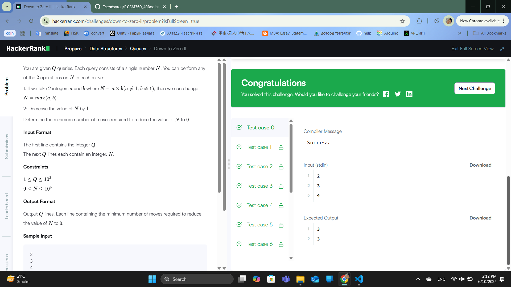
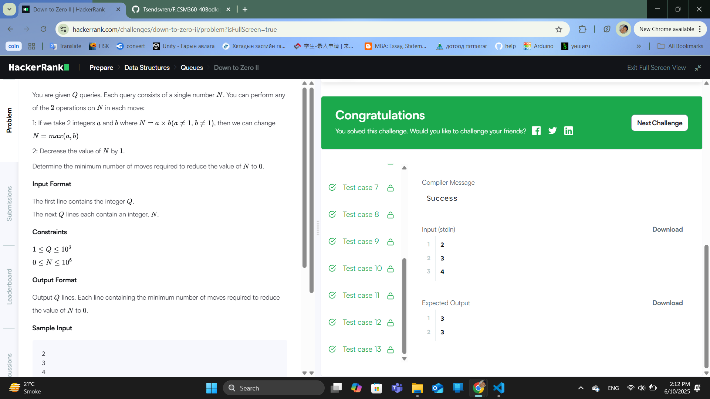

### Бодлого №34

### Down to Zero II /Төрөл: Data Structures, Түвшин: Hard/

Танд зөвхөн дараах дөрвөлжин [], мухар (), болон буржгар {} хаалтууд бүхий тэмдэгт мөр өгөгдөнө. Таны зорилго бол:

Хаалт бүр зөв хосолсон эсэхийг шалгах юм.

Тэмдэгт мөрийг "тэнцвэртэй" гэж үзэх нөхцөл:

Хаалт тус бүр нээж, заавал хаагдсан байх

Хаалт зөв дарааллаар хослох (жишээ нь, [{()}] зөв, харин [({])} буруу)

Оролт:.

Эхний мөр: n — тэмдэгт мөрийн тоо

Дараагийн n мөр тус бүрт: нэг тэмдэгт мөр (зөвхөн хаалт агуулсан)

Гаралт:

Тус бүр мөрөнд: "YES" эсвэл "NO" — тухайн тэмдэгт мөр тэнцвэртэй бол YES, үгүй бол NO.

Жишээ:

Оролт:

3

{[()]}

{[(])}

{{[[(())]]}}

Гаралт:

YES

NO

YES

Шийдэл санаа:

Stack (стек) ашиглана:

Хаалтыг нээх үед стек рүү түлхэж хадгална.

Хаалт хаах үед стекийн орой дээрхтэй таарч байгаа эсэхийг шалгана.

Хэрэв таарахгүй бол NO

Хэрэв стек бүрэн хоосон дуусвал YES

  

  

---

✅ **ТАЙЛАН ДУУСАВ!**