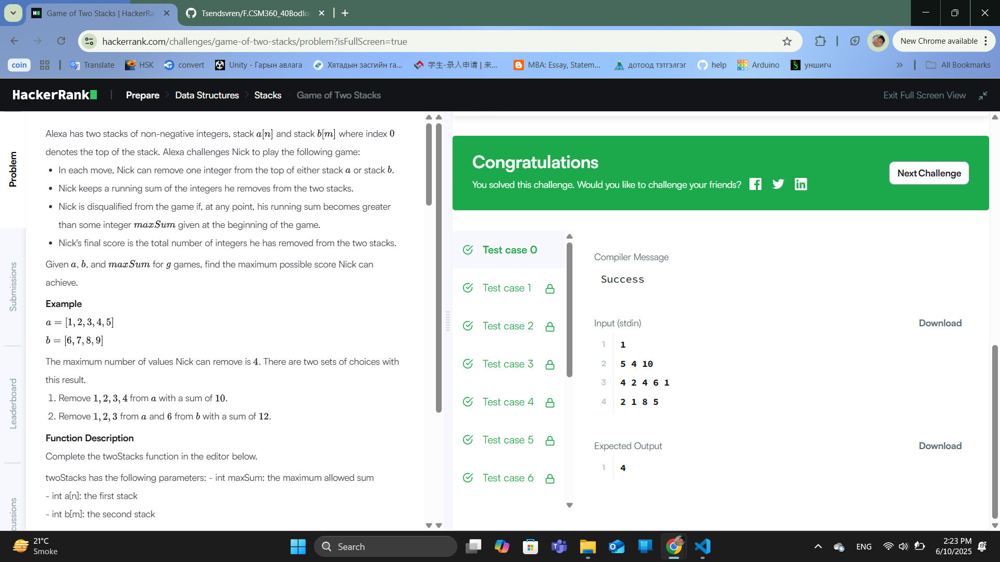
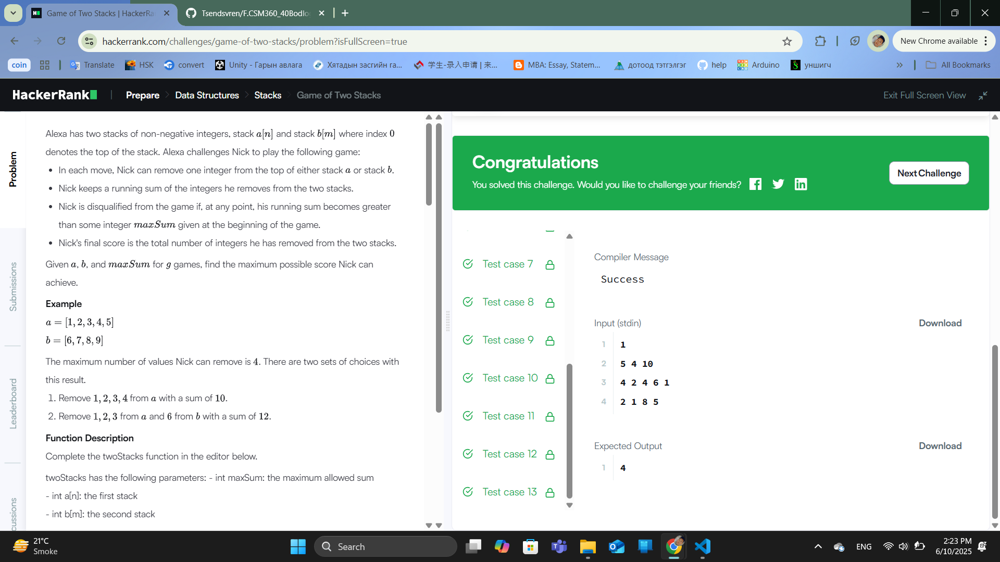

### Бодлого №36

### Game of Two Stacks /Төрөл: Data Structures, Түвшин: Hard/

Танд хоёр стек A ба B өгөгдөнө. Таны зорилго бол эдгээр стекүүдээс дараалан тоо авсаар байгаад, нийт дүн нь x-с ихгүй байх хамгийн их элементийн тоог авах.

Та нэгэн зэрэг зөвхөн нэг стекийн оройгоос тоо авч чадна (A эсвэл B).

Авсан тоонуудын нийлбэр x-с хэтрэхгүй байх ёстой.

Оролт:

Эхний мөр:

g – тоглоомын тоо

Дараа дараагийн мөр бүр:

n m x – A болон B стекүүдийн урт ба дээд хязгаар нийлбэр

a₁ a₂ ... aₙ – стек A

b₁ b₂ ... bₘ – стек B

Гаралт:

Тоглоом бүрийн хувьд:

x-с их болгохгүйгээр авч болох хамгийн олон элементийн тоог хэвлэнэ.

Жишээ:

Оролт:

1

5 4 10

4 2 4 6 1

2 1 8 5

Гаралт:

4

Тайлбар:

A-с: 4 + 2 = 6

B-с: 2 + 1 = 3

Нийт: 6 + 3 = 9 ≤ 10, авсан элемент: 4 ширхэг

Шийдэл санаа:

Эхлээд A стекээс аль болох олон элемент авна (sum ≤ x)

Дараа нь B-гээс нэг нэгээр нэмэх ба:

Хэтэрвэл A-с 1–1-ээр буцаан хасч x-д багтаахыг оролдоно

Бүрэн BFS хийх шаардлагагүй, greedy + хоёр pointer арга хэрэглэнэ

  

  

---

✅ **ТАЙЛАН ДУУСАВ!**