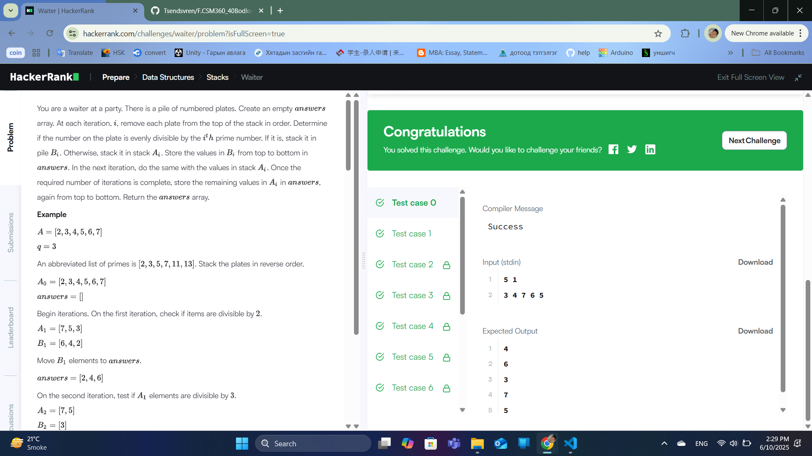
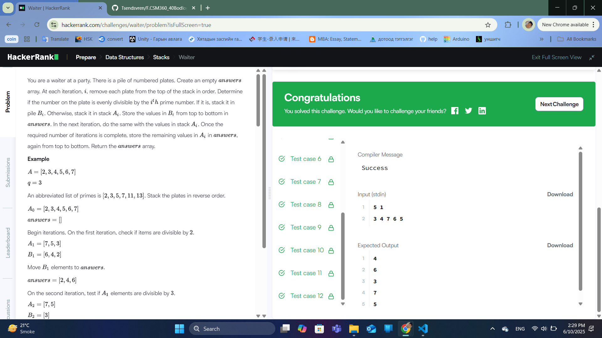

### Бодлого №37

### Waiter /Төрөл: Data Structures, Түвшин: Hard/

Танд number нэртэй n ширхэг тавган дээр байгаа тоонуудын жагсаалт, мөн q гэсэн тоо өгөгдөнө. Энэ тоонуудыг дараах зарчмаар хэд хэдэн үе шаттайгаар шүүнэ:

Шат бүр дээр i дахь дараалсан анхны тоо pᵢ ашиглагдана.

Тухайн шатанд:

number стекээс эхнээс нь авч:

pᵢ-д хуваагддаг бол Bᵢ стек рүү

хуваагдахгүй бол Aᵢ стек рүү хийнэ.

Дараагийн шатанд number нь Aᵢ болно.

Үүнийг q удаа давтана.

Эцэст нь: B₁, B₂, ..., B_q, дараа нь хамгийн сүүлд үлдсэн стекийн бүх элементийг stack-аас гаргах дарааллаар хэвлэнэ.

Оролт:

n q

number[0] number[1] ... number[n-1]

Гаралт:

Бүх B-үүдийн агуулгыг гаргах (дээрээс нь доошоо)

Дараа нь A_q стекийн утгуудыг гаргах

Жишээ:

Оролт:

5 1

3 4 7 6 5

Процесс:

i = 1 → p₁ = 2 (анхны тоо)

Хуваагдах тоонууд → B₁ = [4, 6]

Үлдсэн → A₁ = [3, 7, 5]

Гаралт:

6

4

5

7

3

Шийдэл санаа:

q ширхэг анхны тоо (prime) үүсгэж авна

q удаа стекийг задлан шүүнэ

B-үүдийг List<List<Integer>> маягаар хадгалж, дарааллаар хэвлэнэ

  

  

---

✅ **ТАЙЛАН ДУУСАВ!**