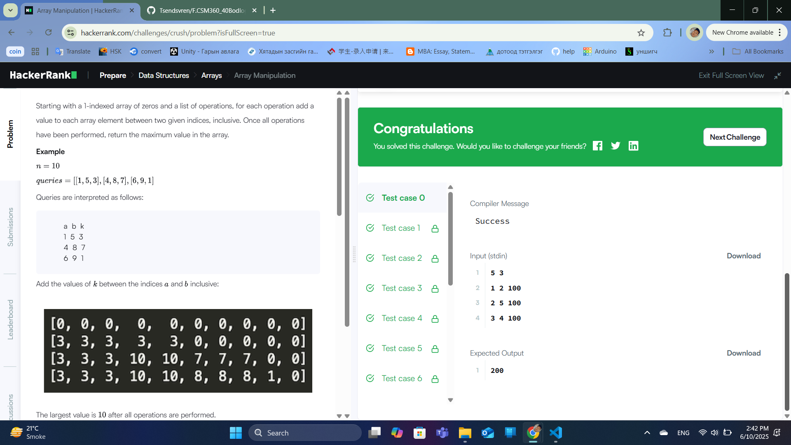
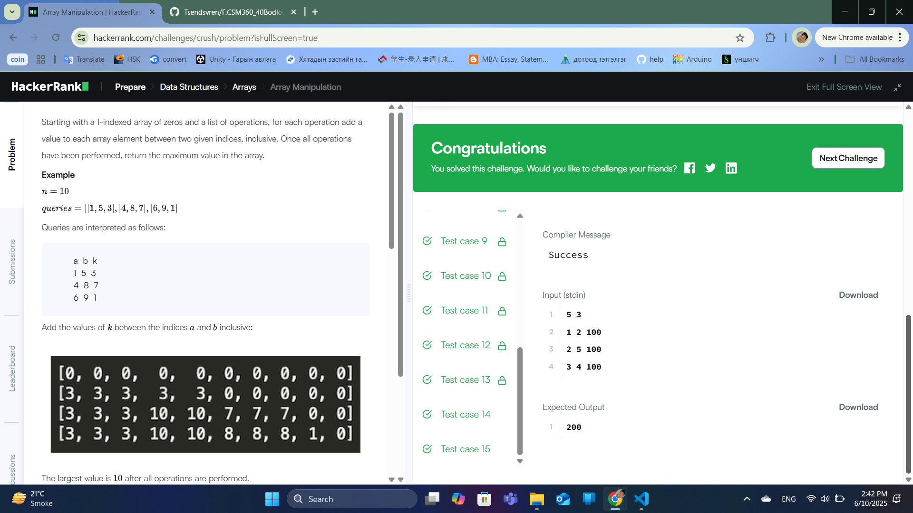

### Бодлого №39

### Array Manipulation /Төрөл: Data Structures, Түвшин: Hard/

Танд n урттай (1-indexed) бүхэл тоон массив болон m ширхэг query (чиглэл) өгөгдөнө. Мэдээлэл бүр нь гурван утга агуулна:

a b k

Эдгээр нь массивын a-с b хүртэлх бүх элементэд k-г нэмнэ гэсэн үг.

Эхлээд бүгдэд нь нэмэгдэл хийсний дараа массив дахь хамгийн их утгыг ол!

Санаа

Шинжлэх ухаан: Хэрэв та a–b цаг хугацааны интервалд k нэмэх бол массивыг шууд явж бүх элементийг өөрчлөхөд O(n) цаг шаардлагатай. m query-тай бол нийт O(n·m) хугацаанд гүйцэтгэхэд TLE ирнэ.

Шийдэл: "Difference array" + prefix sum арга ашиглана:

diff массивыг n+2 урттай нульсээр үүсгэнэ.

Query бүрт diff[a] += k, diff[b+1] -= k гэж тэмдэглэнэ.

Эцэст нь diff-ийн prefix sum авч массивын бодит утгыг олно.

Гаралтын хамгийн их утгыг ол.

Жишээ:

n = 5

queries:

1 2 100

2 5 100

3 4 100

diff массив эхэнд: [0,0,0,0,0,0]

Query1 → [0,+100,0,-100,0,0]

Query2 → [0,100,0,0,0,-100]

Query3 → [0,100,+100,0,-100,-100]

Prefix sum хэдлэхэд бодит массив: [100,200,200,200,100], хамгийн их нь 200 

  

  

---

✅ **ТАЙЛАН ДУУСАВ!**