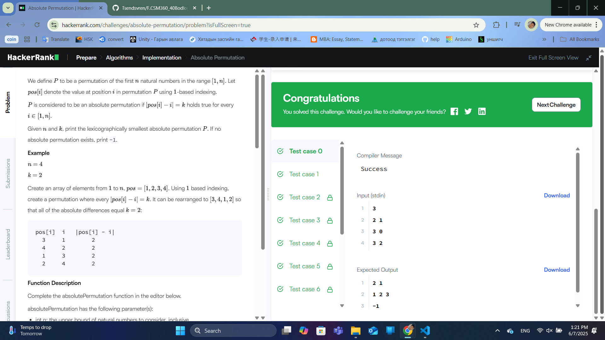
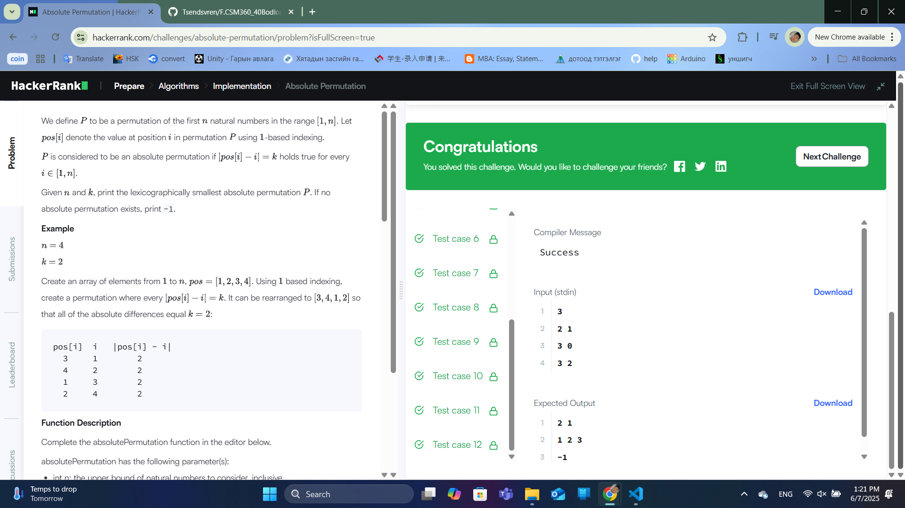

### Бодлого №4

## Absolute Permutation

Бидэнд n ба k гэсэн хоёр бүхэл тоо өгөгдсөн. Бид 1-ээс n хүртэлх тоонуудын сэлгэмэл (permutation) P-г олох хэрэгтэй бөгөөд дараах нөхцөлийг хангасан байна:

|P[i] - i| = k бүх i-д (1 <= i <= n)

Хэрэв ийм олон сэлгэмэл байгаа бол хамгийн жижиг лексикографийн сэлгэмэлийг буцаана. Хэрэв ийм сэлгэмэл байхгүй бол -1 буцаана.

Оролт
Эхний мөр: t (туршилтын тоо)

Дараагийн t мөр бүр: n ба k (хоёр бүхэл тоо)

Гаралт
Туршилт бүрийн хувьд шаардлагатай сэлгэмэл эсвэл -1 хэвлэнэ.

Жишээ

Оролт:

3

2 1

3 0

3 2

Гаралт:

2 1

1 2 3

-1

Бодолт

Энэ бодлогыг шийдэхийн тулд бид k-ийн утгаас хамаарч дараах дүрмийг баримтална:

Хэрэв k = 0: Сэлгэмэл нь [1, 2, ..., n] байх ёстой, учир нь |P[i] - i| = 0 гэдэг нь P[i] = i гэсэн үг.

Хэрэв k > 0:

n % (2*k) == 0 байх ёстой. Эсрэг тохиолдолд сэлгэмэл байхгүй.

Хэрэв n % (2*k) == 0 бол сэлгэмэлийг дараах байдлаар бүтээж болно:

i-р элементийг i + k эсвэл i - k гэж сонгоно.

i-р блок (хэмжээ нь 2*k) бүрт эхний k элементийг i + k, үлдсэн k элементийг i - k гэж сонгоно.

Алгоритм

Хэрэв k = 0 бол [1, 2, ..., n] буцаана.

Хэрэв n % (2*k) != 0 бол -1 буцаана.

Бусад тохиолдолд:

2*k хэмжээтэй блок бүрийг боловсруулна.

Блок бүрийн эхний k элементийг i + k, үлдсэн k элементийг i - k гэж тохируулна.

  

  

---

✅ **ТАЙЛАН ДУУСАВ!**
