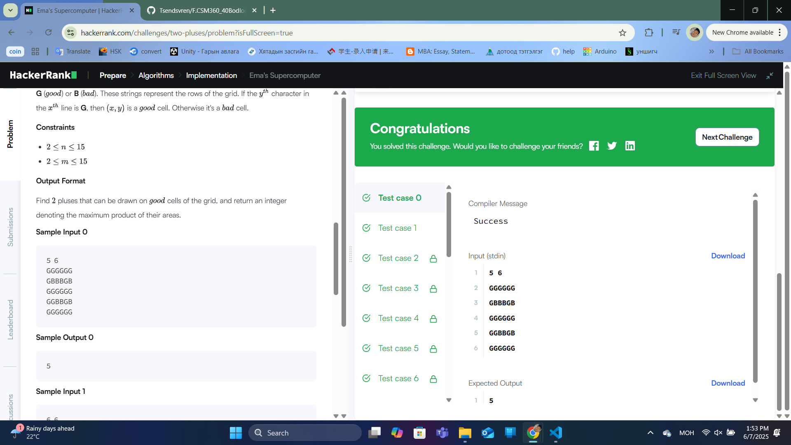
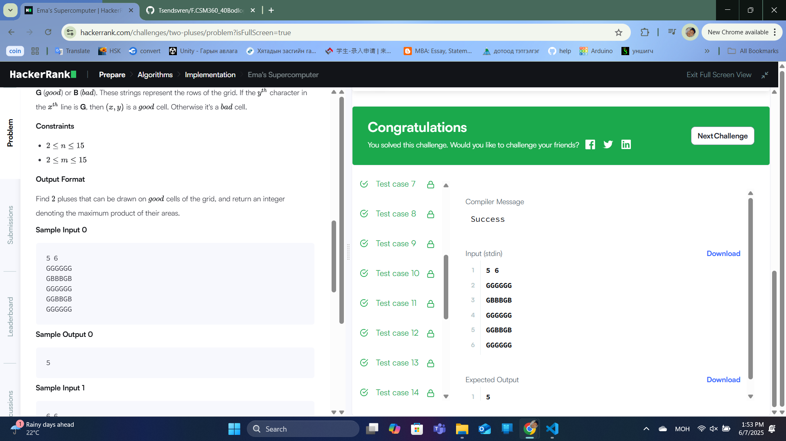

### Бодлого №5

## Ema's Supercomputer /Төрөл: Algorithms, Түвшин: Medium/

n x m хэмжээтэй тор өгөгдөнө. Тор бүрт G (ногоон) эсвэл B (улаан) тэмдэгт байрлана.

Хүчинтэй крест гэдэг нь тэнцүү урттай (сондгой тоо) хэвтээ ба босоо сегментүүдийн огтлолцол юм. Сегментийн дунд нүд нь крестийн төв байх ёстой.

Зураг дээр цэнхэр крестүүд хүчинтэй, улбар шар крестүүд хүчинтэй биш байна. (pluseses.png)

Тор дээрх хоёр хамгийн том хүчинтэй крестүүдийн талбайн үржвэрийг ол. Хоёр крест нь огтлолцохгүй байх ёстой.

Функцийн тодорхойлолт:

twoPluses функцийг гүйцээж, хоёр хамгийн том крестүүдийн талбайн үржвэрийг буцаана.

Оролт:

Эхний мөр: n (мөр) ба m (багана)

Дараагийн n мөр: m урттай G/B-ээс бүрдсэн мөрүүд

Гаралт:

Хоёр крестүүдийн талбайн үржвэрийн хамгийн их утга.

Жишээ оролт ба гаралт

Жишээ 0:

5 6

GGGGGG

GBBBGB

GGGGGG

GGBBGB

GGGGGG

Гаралт:

5

Тайлбар:

1x1 крест (талбай 1) ба 2x2 крест (талбай 5) байж болно. Үржвэр: 1 * 5 = 5.

Жишээ 1:

6 6

BGBBGB

GGGGGG

BGBBGB

GGGGGG

BGBBGB

BGBBGB

Гаралт:

25

Тайлбар:

Хоёр 2x2 крест (талбай 5) байж болно. Үржвэр: 5 * 5 = 25.

Бодолт

Крестийн тодорхойлолт:

Крестийн урт (k) нь сондгой тоо (1, 3, 5, ...).

Талбай: (2k + 1)^2 (жишээ нь, k=1 → талбай 9, k=2 → 25).

Крест олох:

Тор дээрх бүх G нүднүүдийг крестийн төв гэж үзээд, k-ийг нэмэгдүүлэн шалгах.

Хэрэв бүх чиглэлд (дээш, доош, зүүн, баруун) k алхамд G байвал крест хүчинтэй.

Хоёр крест сонгох:

Бүх боломжит крестүүдийг хэмжээгээр нь буурахаар эрэмбэлэх.

Хамгийн том крестээс эхлэн, огтлолцохгүй байх хоёр дахь крестийг хайх.

  

  

  

---

✅ **ТАЙЛАН ДУУСАВ!**
