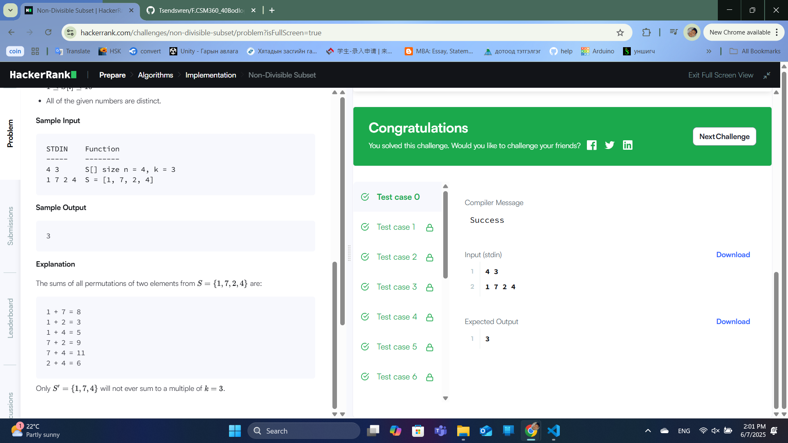
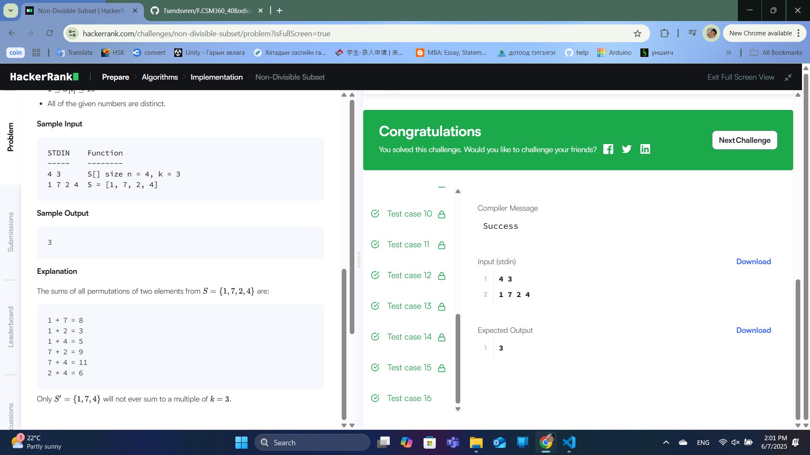

### Бодлого №6

## Non-Divisible Subset

Бидэнд S олонлог болон k бүхэл тоо өгөгдсөн. Бид S-ийн дэд олонлог S'-ийг олох хэрэгтэй бөгөөд S'-ийн аль ч хоёр элементийн нийлбэр k-д хуваагдахгүй байх ёстой. Ийм дэд олонгын хамгийн их хэмжээг ол.

Оролт

Эхний мөр: n (олонлогийн хэмжээ) ба k (хуваагч)

Хоёр дахь мөр: S олонлогийн n ширхэг элемент

Гаралт

Хамгийн их хэмжээтэй дэд олонгын хэмжээ.

Жишээ

Оролт:

4 3

1 7 2 4

Гаралт:

3

Тайлбар:

{1, 7, 4} олонлогт:

1 + 7 = 8 → 3-д хуваагддаггүй

1 + 4 = 5 → 3-д хуваагддаггүй

7 + 4 = 11 → 3-д хуваагддаггүй

Бодолт

Үлдэгдэл ангилал:

Элемент бүрийг k-д хуваахад гарсан үлдэгдлийг (remainder) тооцоол.

Үлдэгдэл нь 0-ээс k-1 хооронд байна.

Хос үлдэгдэл:

Хэрэв r үлдэгдэлтэй тоо байвал k-r үлдэгдэлтэй тоо нь түүнтэй хамт байж болохгүй.

0 үлдэгдэлтэй тоонуудын тоо 1-ээс их байвал зөвхөн нэгийг нь сонгох.

Дүрэм:

max(count[r], count[k-r])-ийг сонгох (r < k-r байхад)

r = 0 эсвэл r = k/2 (хэрэв k тэгш) тохиолдолд зөвхөн нэгийг нь сонгох.

  

  

---

✅ **ТАЙЛАН ДУУСАВ!**
